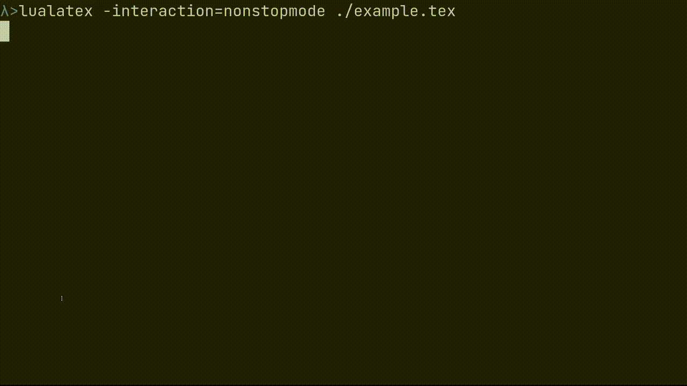

# ltexa



## Introduction

ltexa parses the output of latex and displays warnings, errors, etc, along with
the exact line (if possible) and file where it occurred.

Here is a sample of an error message produced by ltexa:
```
tex/testfile.tex:25: error: Undefined control sequence. (page 12)
At:
       \obscurenonexistantthingy
                             ~~^~~
column: 25
```
and the same error as produced by latex:
```
! Undefined control sequence.
l.25 \obscurenonexistantthingy
```
As you can see, the "raw" latex output lacks information about where the error
actually occurred and on what page in the output. It is also a lot easier to
miss in the log.


## Why?

Personal confession time, I cannot make head nor tail of most of the output
produced by latex. The [latexrun] parser and "pretty print" output solved this
issue but was mainly a build tool. This project was created for two main reasons:

1. To be a latex log parser, nothing more, nothing less
2. To improve my knowledge of Haskell and Parsec

Note that the project now uses megaparsec as I found parsec to be both slow and hard to debug

## Features

- Colour coded output (error is red, warning is purple, line numbers green)
- File and page numbers alongside errors & warnings (where possible)
- "Stack trace" alongside errors, showing the source(s) of the error (where
  possible)
- Support for concatenated log files produced by multiple runs (e.g. output of
  latexmk)

### Disclaimer

As of 0.5.0 the parser is _mostly_ reliable, however there may still be
bugs which cause it to not report everything shown in the log (or miss sections).
If this does happen please open an issue and provide a (preferably small)
example document

## Usage

Running ltexa on a log file:
```bash
ltxa <path to log file>
```

Piping the contents of a log file:
```bash
latex -interaction=nonstopmode <file> | ltxa
```

Note the `-interaction` option. If we try piping it without setting this it will
hang forever waiting on input if an error occurs.

## Installation

Prebuild binaries for x86\_64 windows, mac, and linux _should_ all be available
under each release. I recommend using these as the Haskell tool chain can be a pain to
setup.

### Building from source

This requires the Haskell tool `stack` to be installed and an internet
connection.  Once you have both of these it is as simple as:

```bash
cd <path to clone of repo> && stack install
```

You should now have a `ltxa` binary at the location of `stack path --local-bin`
(`~/.local/bin` and equivalents by default).

## Special thanks to
[latexrun]. This project started as the
source code of latexrun minus everything except the LaTeX parser, and
saved me considerable time when creating the initial parser. If you want a
full build system to replace `latexmk`, check it out.

## Similar projects

- [latexrun]: Provides similar functionality to this project, but acts as a full build system


## License

This project is licensed under the GNU GPLv3. Find it [here](LICENSE)

[latexrun]: https://github.com/aclements/latexrun
